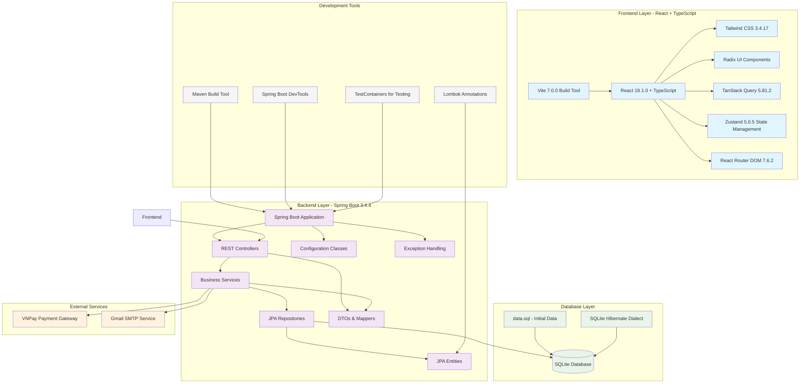
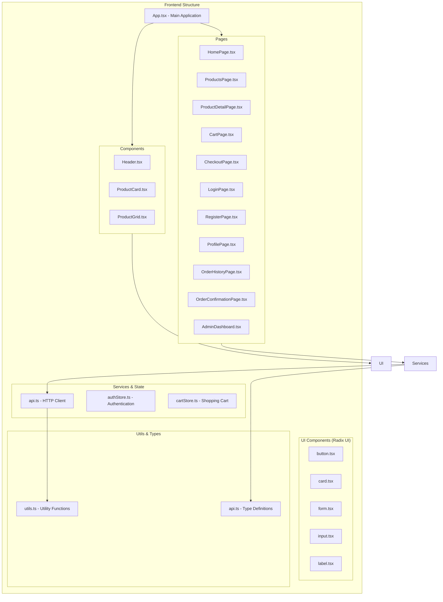
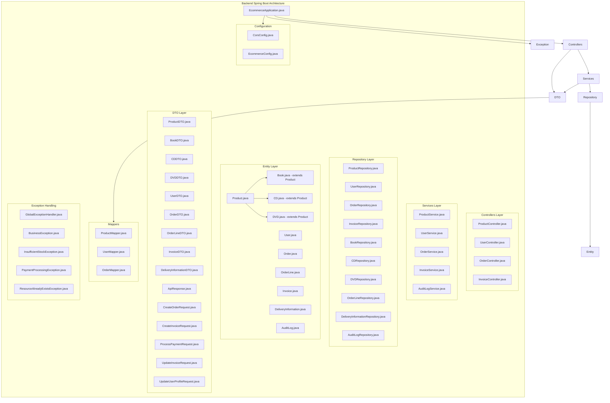
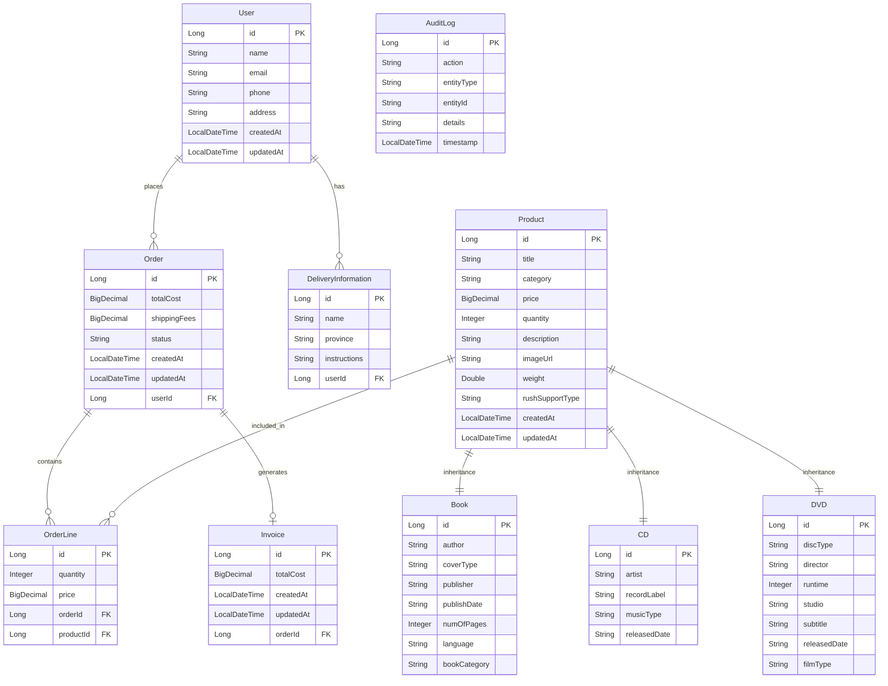
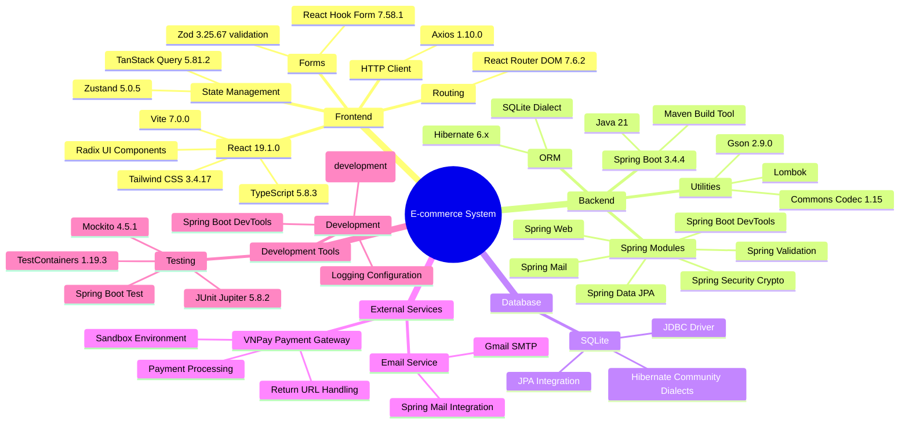
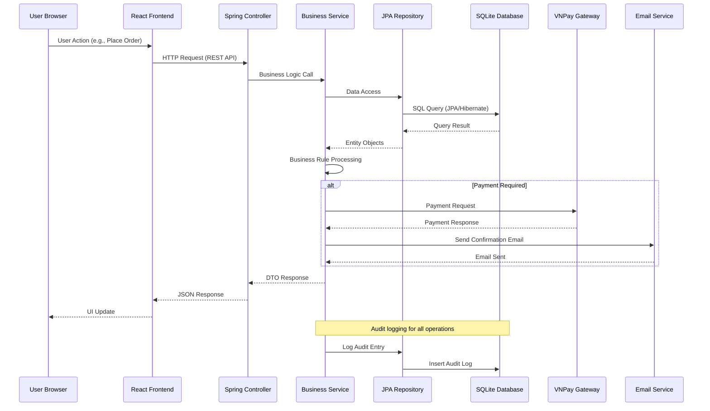
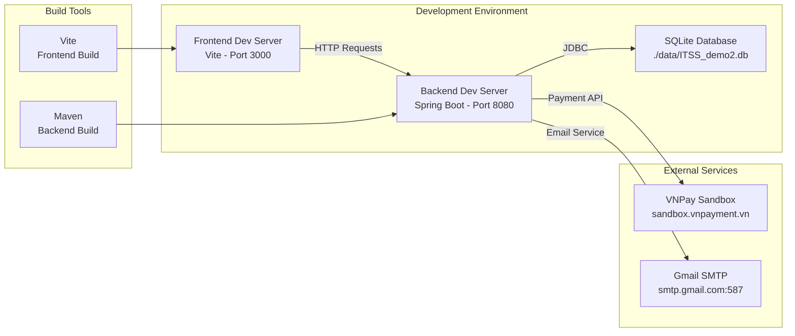

# E-commerce System Architecture

## System Overview Diagram

## Frontend Architecture Details

## Backend Architecture Details

## Database Schema (Entity Relationships)

## Technology Stack Overview

## Request Flow Architecture

## Deployment Configuration

## Key Features & Capabilities

- **Product Management**: Books, CDs, DVDs with inheritance hierarchy
- **User Management**: Registration, authentication, profile management
- **Shopping Cart**: Add/remove items, quantity management
- **Order Processing**: Complete order workflow with order lines
- **Payment Integration**: VNPay payment gateway integration
- **Invoice Generation**: Automated invoice creation
- **Email Notifications**: Order confirmations and notifications
- **Admin Dashboard**: Administrative interface for management
- **Audit Logging**: Complete system activity tracking
- **Responsive Design**: Modern UI with Tailwind CSS and Radix UI
- **State Management**: Zustand for client-side state
- **Data Fetching**: TanStack Query for server state management
- **Form Handling**: React Hook Form with Zod validation
- **Type Safety**: Full TypeScript implementation